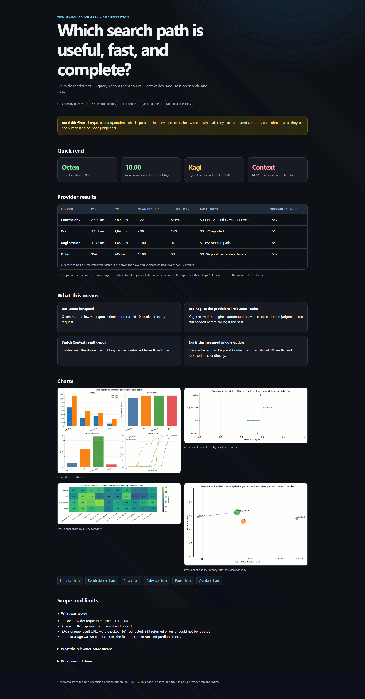
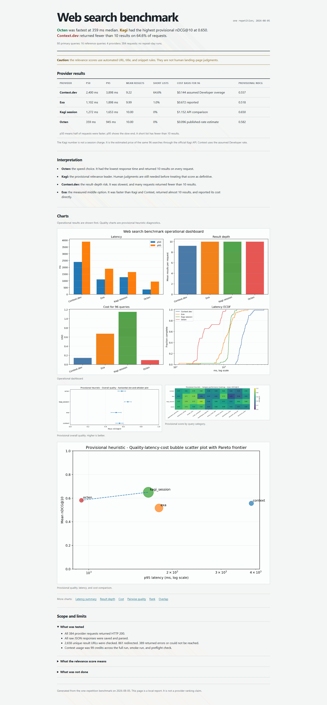

# ui-unslop

A Codex skill for removing formulaic AI styling from frontend UI.

## Before and after

The skill's cleanup pass was applied to this web search benchmark report:

| Before | After |
| --- | --- |
|  |  |
